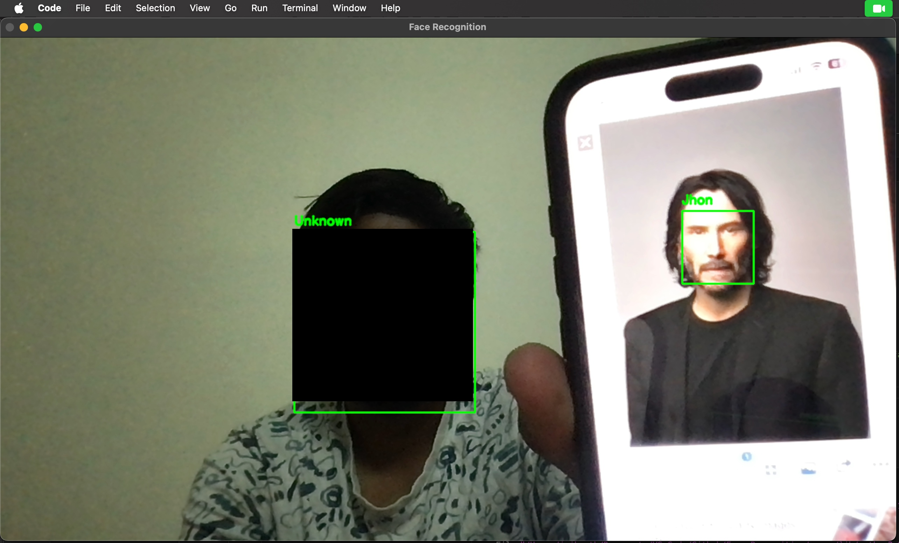

# Face Recognition

## Overview

This project implements a **face recognition system** capable of detecting and identifying faces in images and video streams. It leverages modern computer vision and machine learning techniques to achieve accurate and efficient performance, suitable for both real-time applications and static image processing.

## Features

- **Face Detection**: Locates faces within an image or video frame.
- **Face Recognition**: Identifies individuals based on facial features.
- **Real-time Processing**: Optimized for video stream analysis.
- **Multiple Face Support**: Detects and recognizes multiple faces in a single frame.

## Requirements

- **Python**
- **Cmake**

## Installation

Follow these steps to set up the project on your local machine:

1. **Clone the Repository**  
   Clone the entire AIML repository and navigate to the Face Recognition directory:

   ```bash
   git clone https://github.com/jaikanthh/AIML.git
   cd AIML/Face\ Recognition
   ```

2. **Create a Virtual Environment** (Optional but recommended)  
   Set up a virtual environment to manage dependencies:

   ```bash
   python -m venv venv
   source venv/bin/activate  # On Windows: venv\Scripts\activate
   ```

3. **Install Dependencies**  
   Install the required Python packages (assumes a `requirements.txt` file exists):

   ```bash
   pip install -r requirements.txt
   ```

4. **Add Training Data**  
   Make a folder with your name inside the "data" Folder and place your images in that respective folder.
   If you dont see data folder either make one or just run the main.py once.   
   

## Usage


### Recognize Faces in a Video Stream

To process a live video feed (e.g., from a webcam):

```bash
python main.py
```

**[Add other usage examples specific to your project, e.g., additional command-line arguments or modes]**

## How It Works

The face recognition system operates in three key steps:

1. **Face Detection**: Detects faces using [e.g., Haar cascades, HOG, or MTCNN].
2. **Feature Extraction**: Extracts facial features with [e.g., a pre-trained CNN or Dlib’s face encoding].
3. **Recognition**: Matches features against a database of known faces.
4. **Log**: Makes a Excel Sheet of detected faces with timestamps


## Examples



## Contributing

Contributions are welcome! To contribute:

1. Fork the repository.
2. Create a new branch for your feature or bug fix.
3. Submit a pull request with a clear description of your changes.  

## License

This project is licensed under the MIT License. See the [LICENSE](LICENSE) file for more information.

## Contact

For questions, suggestions, or issues, please reach out:  
- GitHub: [jaikanthh](https://github.com/jaikanthh)  
- Email: [Jaikanth](mailto:jaikanthkamisetti@gmail.com)
